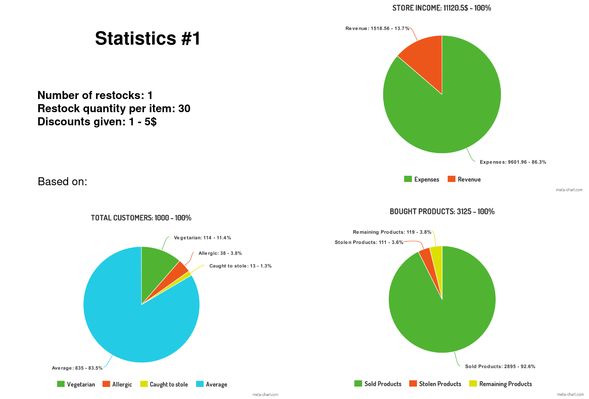
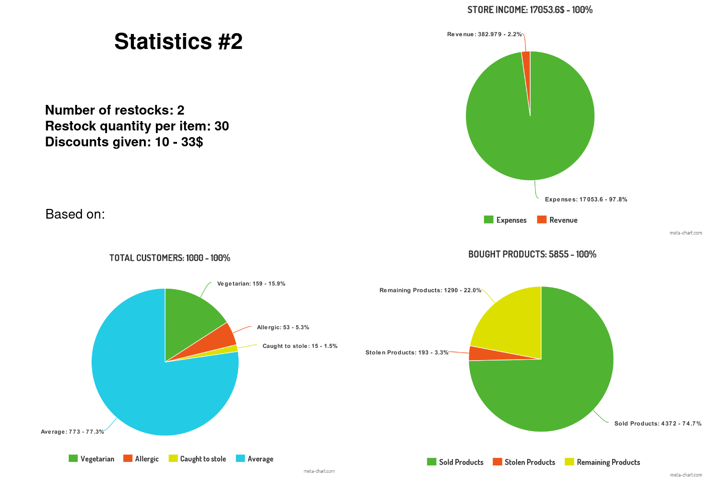
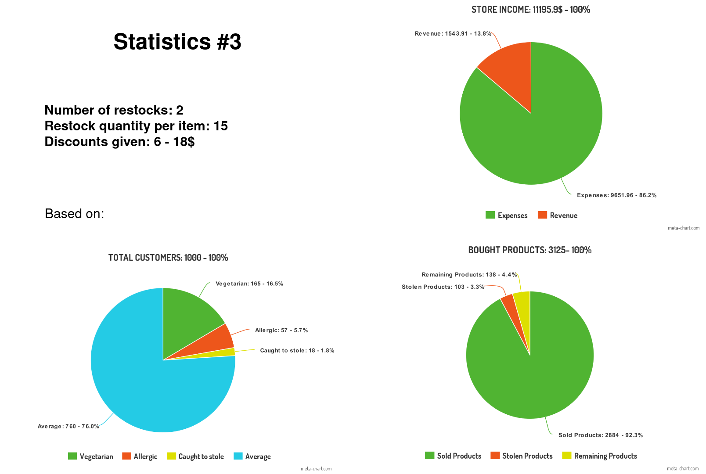
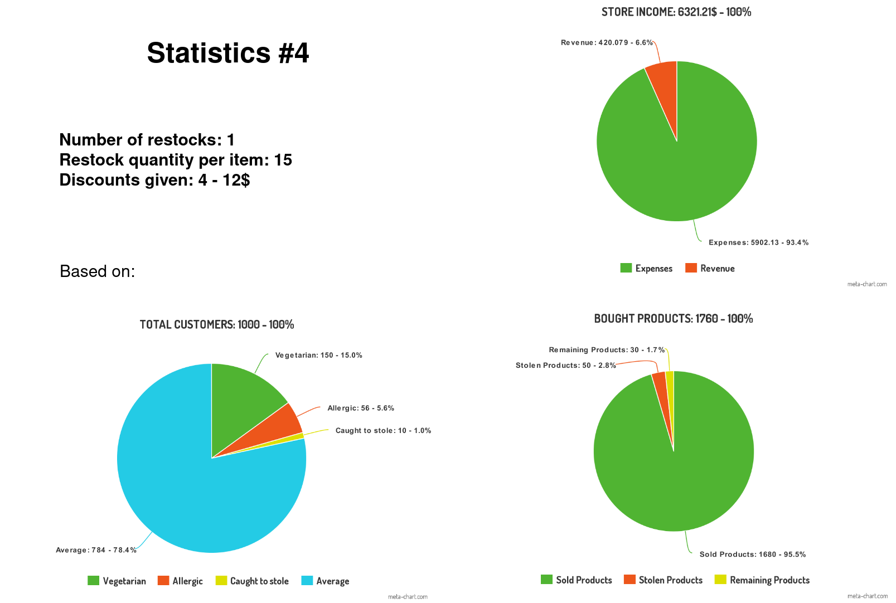
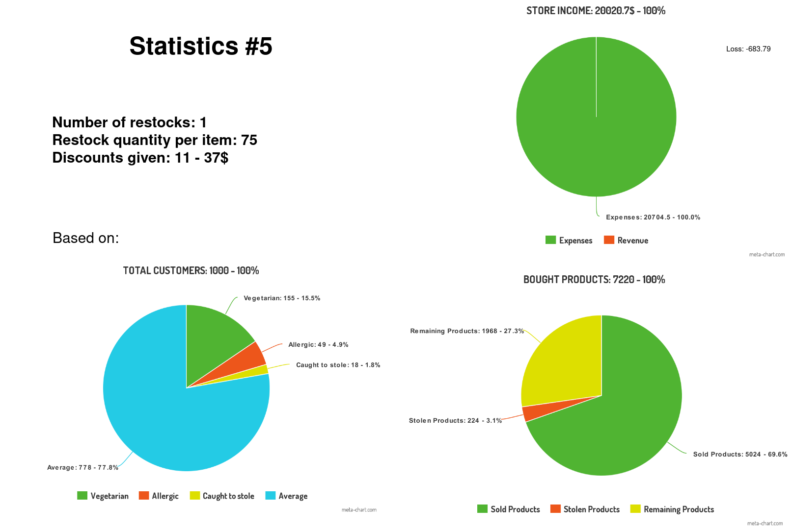

*Lab 5, OOP*

# Store Simulation

Declared Classes:
* Object
* Store
* People
* Customer
* Employee
* Item
* Food
* Drink

## Scenarios

1. The customer enters the store
2. Checks his balancce
3. He can go to: Main Section, Meat Section, Fish Section, Drink Section and Vending Machine 
4. Choose the items he wants
5. Everytime an item is take, his quantity in the store diminishes
6. The item can be/become out of stock
7. The worker of Fish/Meat Section can be temporarily on a break
8. The customers goes to pay at the cashier
9. If he has 12 items, he receives a 10% discount 
10. There is a tiny possibility that the he trys to leave the store without paying
11. There is a possibility to be stopped by the Security Guard to control the cheque
12. If he has a cheque, he is free, if not, he must go to pay
13. The customers leaves the store
14. Once per simulation, a restock of items in the store can be done

### New:
1. Person can be allergic, vegan etc.
2. Employees have salary
3. A customer might not have enoguh money for all he bought
4. Store boughts products, has expenses
5. Store has revenue/loss
6. Statistics are made based on calculated data:
    * Store income/outcome
    * Customers allergic/vegan//can stole
    * Products bought, sold, remaining, stoled

## Statistics

  
  
  
  
  

